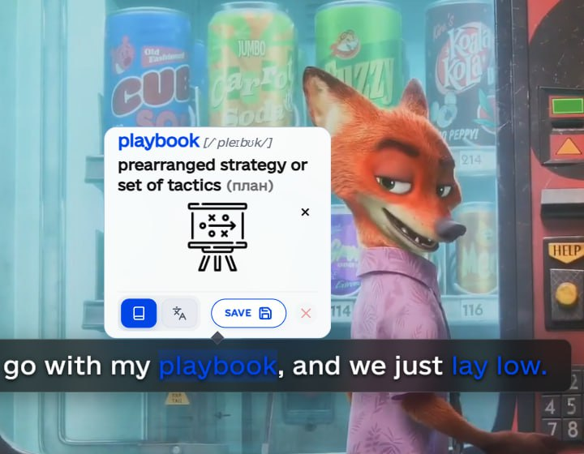
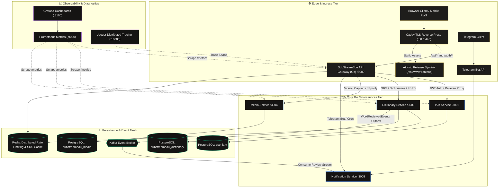

<div align="center">

# 🎬 SubStreamEdu

**Cognitive Language Acquisition Ecosystem Powered by Streaming Media & FSRS v4**

*Turn authentic video essays, cinema, music, and subtitles into durable vocabulary retention.*

[](https://github.com/zyoneal/substreamedu-go/actions/workflows/ci.yml)
[](https://github.com/zyoneal/substreamedu-go/actions/workflows/cd.yml)
[](https://go.dev/)
[](https://react.dev/)
[](https://github.com/open-spaced-repetition/fsrs4go)
[](https://github.com/GoogleContainerTools/distroless)
[](LICENSE)
[](https://substreamedu.com)

<br/>



<br/>

[**Explore Live Demo (substreamedu.com)**](https://substreamedu.com) • [**Architecture**](#-architecture--event-driven-mesh) • [**Microservices**](#-microservices-ecosystem) • [**Quick Start**](#-quick-start) • [**API Health Matrix**](#-orchestration--health-matrix)

</div>

<br/>

---

## 🌟 Executive Overview

**SubStreamEdu** is an enterprise-grade language acquisition ecosystem that eliminates the friction between authentic native immersion (YouTube video essays, cinema releases, Spotify music tracks, and synchronized SRT/VTT subtitles) and long-term neuro-cognitive memory retention.

By combining real-time in-context lexeme discovery with an implementation of the **Free Spaced Repetition Scheduler (FSRS v4)** in pure Go, SubStreamEdu automates the pathway from passive media enjoyment to active recall and bidirectional fluency:
- **Recognition Cards ($L_2 \to L_1$)**: Target word + authentic media caption snippet $\to$ recall native translation.
- **Production Cards ($L_1 \to L_2$)**: Native translation + contextual cloze deletion sentence $\to$ recall target term.

> [!TIP]
> **Performance Milestone**: The entire backend was re-engineered from a monolithic Spring Boot architecture into **5 decoupled, event-driven Go microservices**. This reduced the production server RAM footprint by **~1.3GB** and achieved sub-millisecond route dispatch latency (`<5ms` p95) under 100% Distroless non-root security.

---

## ⚡ Key Architectural Highlights

| Pillar | Engineering Realization | User Impact |
| :--- | :--- | :--- |
| **🎬 Interactive Streaming Sync** | Frame-accurate SRT/VTT caption parsers with tokenized lexeme overlays on YouTube, video uploads, and Spotify tracks. | Instant one-click dictionary lookups and context sentences without breaking playback flow. |
| **🧠 Pure Go FSRS v4 Scheduler** | Native Go implementation of the modern Free Spaced Repetition Scheduler (`Stability`, `Difficulty`, `Retrievability`). | Superior retention rates compared to legacy SM-2 (Anki) algorithms; zero external Python runtime overhead. |
| **📱 Synchronous Telegram Bot** | Event-driven notification service integrated with Outbox/Kafka; daily queue alerts and interactive voice TTS reviews. | Seamless cross-device habit loop; practice flashcard reviews on commute without opening the browser. |
| **🎨 Cinematic Design System** | Midnight espresso canvas (`#0d0c0b`), dual-tier micro-reticle cursor (ADR-015), 35mm lens vignette & projector glow (ADR-016), multi-plane parallax (ADR-017). | SOTD/Awwwards-grade visual elegance; zero layout reflow; 100% hardware-accelerated GPU transforms. |
| **🔒 Enterprise Zero-Trust & Distroless** | Google Distroless containers (`gcr.io/distroless/static-debian12:nonroot`), UID 65532, embedded Go health probes (`/app/healthcheck`), JWT validation. | Minimal attack surface; zero shell/curl utilities in runtime containers; 0-CVE base images. |
| **🔄 Zero-Downtime Atomic CD** | Atomic asset symlink swapping (`current -> releases/<timestamp>`), BuildKit cache mounts, dynamic Caddy hot-reloads. | Deployments execute with 0ms downtime and zero dropped HTTP connections or asset 404s. |

---

## 🏗️ Architecture & Event-Driven Mesh

SubStreamEdu is structured as a decoupled, event-driven microservices topology coordinated through an API Gateway, asynchronous Kafka message brokers, and Caddy TLS edge routing.



---

## 📦 Microservices Ecosystem

| Service | Directory | Port | Protocol | Purpose & Key Responsibilities |
| :--- | :--- | :--- | :--- | :--- |
| **Gateway** | [`substreamedu-gateway-go`](substreamedu-gateway-go) | `8080` | HTTP / REST | High-throughput ingress entrypoint, sliding-window rate limiting, CORS management, and reverse proxying. |
| **IAM Service** | [`substreamedu-iam-service-go`](substreamedu-iam-service-go) | `3002` | HTTP / REST | Identity management, Google OAuth2, bcrypt password hashing, JWT minting & role-based claims verification. |
| **Dictionary Service** | [`substreamedu-dictionary-service-go`](substreamedu-dictionary-service-go) | `3003` | HTTP / REST | FSRS v4 repetition scheduler, dual-card generation (Recognition / Production), Anki `.apkg` export, Redis caching. |
| **Media Service** | [`substreamedu-media-service-go`](substreamedu-media-service-go) | `3004` | HTTP / REST | Video stream ingestion, YouTube captions, Spotify metadata & track lyrics, SRT/VTT parsing and synchronization. |
| **Notification Service** | [`substreamedu-notification-service-go`](substreamedu-notification-service-go) | `3005` | HTTP / Telegram | Automated Telegram Bot, cron-scheduled spaced review reminders, instant audio TTS synthesis, and habit streaks. |
| **Frontend Web Client** | [`substreamedu-frontend`](substreamedu-frontend) | `3000` / `80` | SPA / React 18 | Responsive web application with Cinematic Espresso design system, dual-tier cursor, GSAP & Framer Motion scroll flow. |

---

## 🚀 Quick Start

### Prerequisites
* [Docker Engine](https://docs.docker.com/engine/install/) $\ge 24.0$ & [Docker Compose v2](https://docs.docker.com/compose/)
* [Go](https://go.dev/dl/) $\ge 1.26$ *(optional, for native local host development)*
* [Node.js](https://nodejs.org/) $\ge 20$ *(optional, for frontend client development)*

### 1. Clone & Configure
```bash
git clone https://github.com/zyoneal/substreamedu-go.git
cd substreamedu-go

# Copy template configuration
cp .env.example .env
```

### 2. Automated Stack Launch
Launch the complete cluster (Go microservices, PostgreSQL, Kafka, Redis, Caddy, and Observability tools) with automated health probe verification:
```bash
./start.sh
```

### 3. Verify Health & Ready State
Once initialized, check service status in Docker:
```bash
docker compose ps
```

---

## 🛠️ Developer Tooling (`Makefile`)

The root `Makefile` provides standardized ergonomics for development, testing, and continuous delivery:

```bash
# Cluster Management
make docker-up       # Spin up all containers and build local images
make docker-down     # Stop and tear down the cluster
make docker-logs     # Tail streaming logs from all active containers

# Testing & Verification
make test            # Execute Go unit and concurrency race detector tests (-race)
make lint            # Run golangci-lint static analysis across all microservices
make vet             # Run 'go vet' across all Go microservices
make clean           # Remove compiled local static binaries
```

### Running Frontend Locally (Fast Refresh)
```bash
cd substreamedu-frontend
npm install
npm start
# Web app running at http://localhost:3000 (proxies /api to http://localhost:8080)
```

---

## 🌐 Orchestration & Health Matrix

### Public Ingress URLs
| Endpoint | URL | Description |
| :--- | :--- | :--- |
| **Production Web Client** | `https://substreamedu.com` | Primary user-facing web application. |
| **Local Web Interface** | `http://localhost` | Served via Caddy HTTP reverse proxy. |
| **API Gateway Ingress** | `http://localhost:8080` | Unified Go API gateway entrypoint. |

### Microservice Actuator Endpoints
Each service provides an embedded, zero-dependency Go healthcheck probe:
| Service | Actuator URL | Health Metric Checked |
| :--- | :--- | :--- |
| **Gateway** | `http://localhost:8080/gateway/actuator/health` | Network availability, Redis connectivity. |
| **IAM Service** | `http://localhost:3002/auth-service/actuator/health` | PostgreSQL (`sse_iam`) connection pool. |
| **Dictionary Service** | `http://localhost:3003/dictionary-service/actuator/health` | PostgreSQL (`substreamedu_dictionary`) & Redis. |
| **Media Service** | `http://localhost:3004/media-service/actuator/health` | PostgreSQL (`substreamedu_media`) & video buffer. |
| **Notification Service** | `http://localhost:3005/notification-service/actuator/health` | Telegram Bot API connection & Kafka consumer. |

### 📊 Observability & Diagnostics
| Tool | Local URL | Credentials | Purpose |
| :--- | :--- | :--- | :--- |
| **Prometheus** | `http://localhost:9090` | None | Time-series metrics collection & alert rules. |
| **Grafana** | `http://localhost:3100` | `admin` / `admin` | Real-time dashboards, latency percentiles & DB query graphs. |
| **Jaeger UI** | `http://localhost:16686` | None | Distributed request tracing across microservice boundaries. |

---

## 🛡️ Enterprise Security & Invariants

SubStreamEdu adheres to Senior Engineer Spec-Driven Development (SDD) standards:

1. **100% Distroless Containers**: Every Go microservice compiles into a static, stripped binary (`-ldflags="-s -w -extldflags '-static'"`) packed into `gcr.io/distroless/static-debian12:nonroot` with UID `65532`. No shell, package managers, or root privileges exist in production images.
2. **Deterministic Database Migrations**: Database schemas are managed via versioned SQL migrations (`golang-migrate`) tracked in isolated `schema_migrations` tables across each database.
3. **Strict Zero-Trust Identity**: Mutation routes (`POST`, `PUT`, `DELETE`) require cryptographically verified JWT claims; no service relies on untrusted query parameters (`?userId=...`) or spoofable client headers.
4. **Resilient Circuit Breaking**: External integrations (dictionary APIs, YouTube/Spotify scrapers) feature hard timeouts (`<1.2s`) and circuit-breaker cooldowns to prevent cascading HTTP connection pool exhaustion.

---

## 📄 License

This project is licensed under the **MIT License** — see the [LICENSE](LICENSE) file for details.
