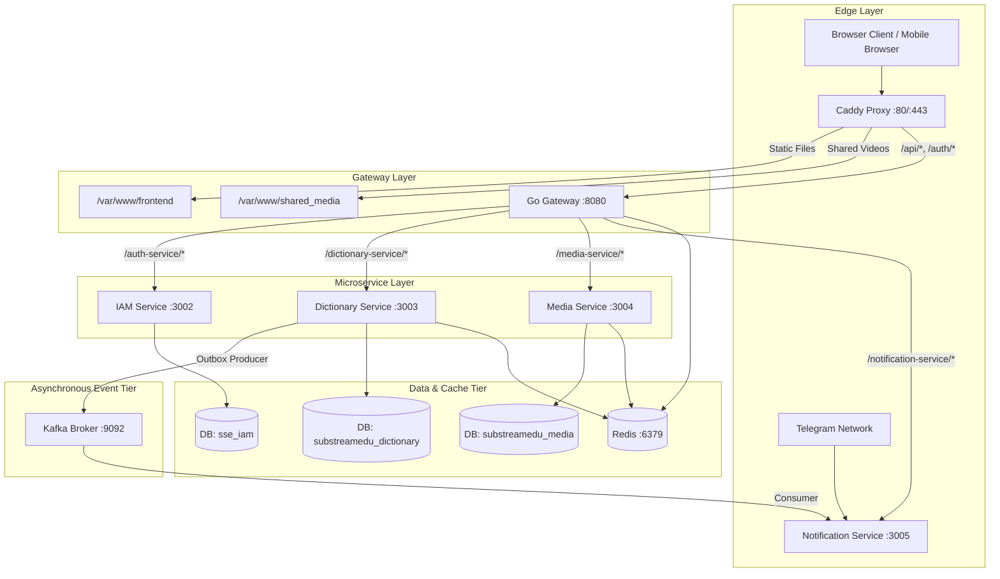

# SubStreamEdu: System Architecture & Invariants

## 1. Tech Stack & Responsibilities

| Tier / Component | Technology | Primary Responsibility |
| :--- | :--- | :--- |
| **Edge Proxy** | Caddy v2 | TLS termination, HTTP/2 & HTTP/3, static asset delivery, media reverse-proxying |
| **API Gateway** | Go (`net/http`, custom router) | Single entrypoint, rate-limiting, CORS, route dispatching, token revocation cache |
| **IAM Service** | Go 1.26, Gin, pgxpool | User accounts, Google OAuth2, JWT issuance, usage limits, promo codes |
| **Dictionary Service** | Go 1.26, Gin, pgxpool, pgvector | Vocabulary storage, FSRS scheduling, Anki/CSV export, AI context enrichment |
| **Media Service** | Go 1.26, Gin, pgxpool, SubDL | SRT/VTT parsing, YouTube metadata, external subtitle search & download |
| **Notification Service** | Go 1.26, pgxpool, Telebot | Telegram Bot engine, daily flashcards, reminder cron, Kafka consumer |
| **Primary Database** | PostgreSQL 15 + pgvector | Relational entities, SRS scheduling states, transactional outbox events |
| **Cache & Rate Limit** | Redis 7 Alpine | Rate-limit counters, token blacklists, subtitle query caches |
| **Message Broker** | Apache Kafka 7.5 + Zookeeper | Event-driven inter-service messaging (`word-reviewed-events`) |
| **Frontend Client** | React 18, TypeScript, Tailwind CSS | Single Page Application, WebGL/HTML5 video sync, interactive subtitles |
| **Observability** | Prometheus, Grafana, Jaeger, Loki | Distributed tracing (OTel gRPC), metrics scraping, structured log aggregation |

---

## 2. Layer Boundaries & Communication Patterns

### Communication Rules
1. **Inbound HTTP Traffic**: External clients interact **only** through Caddy on ports 80/443. Direct container ports are not published to the public network.
2. **Synchronous Inter-Service Calls**: Direct HTTP calls between services (e.g., `Dictionary -> IAM` for usage validation) must use internal Docker DNS and carry an `Internal-Service-Key` header; they must never traverse the public gateway.
3. **Asynchronous Decoupling**: All domain state changes that trigger side effects across service boundaries (e.g., card reviewed, streak updated) must use the **Transactional Outbox Pattern** with Kafka publishing to ensure zero lost events.

---

## 3. Storage Strategy

1. **Relational Database (`PostgreSQL`)**:
   - Stores lean metadata: user profiles, flashcard state, review logs, FSRS parameters, and subtitle cue timestamps.
   - Embeddings are stored in-row as `vector(384)` with HNSW cosine indexes.
   - Under no circumstances should binary media blobs (MP4 videos, audio files) be stored inside PostgreSQL columns.
2. **File System / Shared Media (`/var/www/shared_media`)**:
   - Reusable video clips, audio tracks, and static assets reside on persistent container volumes mounted to Caddy for high-speed direct disk streaming.
3. **In-Memory Cache (`Redis`)**:
   - Ephemeral cache only: revoked JWT identifiers (TTL = JWT expiry), IP rate-limit sliding windows, and subtitle catalog listings (TTL = 30m).

---

## 4. System Invariants (Non-Negotiable Rules)

1. **Authentication Enforcement on Mutations**:
   Every state-modifying endpoint (`POST`, `PUT`, `PATCH`, `DELETE`) across **all** microservices must enforce JWT token verification. Handlers must extract the authenticated user identity strictly from the verified JWT context (`c.Get("userId")`), never from request query parameters (`?userId=...`) or user-supplied headers (`X-User-Id`).
2. **Zero Internal Endpoints on Public Gateway**:
   Any route designated for inter-service communication (e.g., `/auth/internal/*`) must be blocked at the Gateway ingress or protected by a shared cryptographically secure internal service token.
3. **Execution Time Ceiling & Offloading**:
   No synchronous HTTP endpoint may block for greater than `10 seconds`. Operations involving batch embedding generation, mass Anki APKG exports (>500 cards), or bulk file uploads must be handled via background asynchronous jobs with polling or event streams.
4. **Idempotent, Versioned Migrations**:
   All database schema changes must be declared as sequential versioned SQL migration files (`*.up.sql` / `*.down.sql`) managed exclusively by `golang-migrate/migrate/v4`. No application service may run dynamic `ALTER TABLE` or runtime DDL strings during normal application startup.
5. **Zero Leaked Goroutines**:
   Any asynchronous Go routine spawned must accept and propagate a `context.Context` bounded by cancellation, or be dispatched to a structured worker pool with error logging and telemetry tracing. Raw unmonitored `go func() { ... }()` calls are banned.
