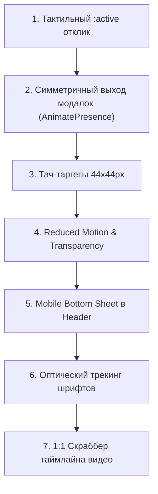

# Spec 27: Apple Design Interface Polish & Fluid Interactions

## Metadata
- **Spec ID**: 27
- **Title**: Apple Design Interface Polish & Fluid Interactions
- **Status**: Ready for Implementation
- **Priority**: P1 (Visual Polish, Direct Manipulation & Accessibility)
- **Target Files**:
  - `substreamedu-frontend/src/components/ui/button.tsx`
  - `substreamedu-frontend/src/components/ui/modal.tsx`
  - `substreamedu-frontend/src/components/ui/modal.module.css`
  - `substreamedu-frontend/src/components/shared/TranslationPopover.tsx`
  - `substreamedu-frontend/src/components/Header.tsx`
  - `substreamedu-frontend/src/components/Header.module.css`
  - `substreamedu-frontend/src/components/HomePage/HomePage.module.css`
  - `substreamedu-frontend/src/components/VideoPage/VideoPlayer.tsx`
  - `substreamedu-frontend/src/components/VideoPage/css/VideoPlayerPopover.module.css`
  - `substreamedu-frontend/src/index.css`
  - `substreamedu-frontend/src/typography.css`
  - `context/progress_tracker.md`

---

## 1. Problem Statement & Apple Design Benchmarks

После аудита интерфейса SubStreamEdu по установленным правилам [`.agents/skills/apple-design/SKILL.md`](file:///Users/test/Desktop/substreamedu-go/.agents/skills/apple-design/SKILL.md) (WWDC *Designing Fluid Interfaces* & *Principles of Great Design*), выявлен ряд ключевых несоответствий стандартам плавного взаимодействия Apple:

1. **Отсутствие тактильного отклика на `:active`**: Кнопки имеют hover-состояния, но лишены мгновенной компрессии при нажатии на pointer-down (`scale(0.97)`), из-за чего на мобильных устройствах интерфейс ощущается статичным.
2. **Асимметрия и резкий unmount модалок**: Диалоговые окна (`Modal`, `TranslationPopover`) монтируются с CSS-анимацией, но при закрытии мгновенно уничтожаются из DOM (`return null`), нарушая принцип симметричных траекторий.
3. **Недостаточный размер touch-targets (< 44px)**: Кнопка закрытия модалки (32px), компактные кнопки (32–36px) нарушают правило Apple HIG о минимальной области нажатия 44×44px.
4. **Отсутствие флагов доступности**: Нет обработки `@media (prefers-reduced-motion)` и `@media (prefers-reduced-transparency)`, присутствуют непрерывные 10-секундные фоновые покачивания (`projectorHum`).
5. **Десктопный выпадающий список вместо нативного Mobile Sheet**: Мобильное меню в Header открывается как резкий прямоугольный поповер, а не плавный bottom-sheet с жестом закрытия.
6. **Ошибочный отрицательный трекинг на body**: В `typography.css` задан `letter-spacing: -0.01em` на `.text-body`, склеивающий буквы в наборном тексте вопреки правилу оптического трекинга Apple.
7. **Дискретная перемотка видео вместо 1:1 манипулирования**: Скраббер таймлайна не использует `setPointerCapture` и не дает непрерывного отклика при перетаскивании.

---

## 2. Seven-Step Implementation Roadmap



---

### Шаг 1: Тактильный `:active` отклик на кнопки и элементы управления
- [x] **Целевые файлы**:
  - `substreamedu-frontend/src/components/ui/button.tsx`
  - `substreamedu-frontend/src/components/Header.module.css`
  - `substreamedu-frontend/src/components/HomePage/HomePage.module.css`
  - `substreamedu-frontend/src/components/ui/modal.module.css`
  - `substreamedu-frontend/src/components/VideoPage/css/VideoPlayerPopover.module.css`
- [x] **Правило Apple Design (Секция 1)**:
  - *«Respond on pointer-down, not on release. Highlight a button the instant it's pressed. Waiting for click/touch-up feels dead.»*
- [x] **Реализация**:
  - В `button.tsx` добавить в `buttonVariants`: `active:scale-[0.97] active:transition-transform active:duration-100 select-none cursor-pointer`.
  - В `Header.module.css` добавить тактильный отклик для `.signUpButton:active`, `.navItem:active`, `.customLangBtn:active`, `.menu:active`, `.logo_container:active`.
  - В `HomePage.module.css` унифицировать нажатия карточек, фильтров, демо-кнопок.
  - В `modal.module.css` и `VideoPlayerPopover.module.css` добавить `:active { transform: scale(0.97); }`.
- [x] **Критерий приемки**:
  - При нажатии пальцем или мышью любая кнопка мгновенно сжимается до 96–97% и плавно возвращается при отпускании.

---

### Шаг 2: Симметричные анимации закрытия и прерываемость (AnimatePresence)
- [x] **Целевые файлы**:
  - `substreamedu-frontend/src/components/ui/modal.tsx`
  - `substreamedu-frontend/src/components/ui/modal.module.css`
  - `substreamedu-frontend/src/components/shared/TranslationPopover.tsx`
  - `substreamedu-frontend/src/components/VideoPage/css/VideoPlayerPopover.module.css`
- [x] **Правило Apple Design (Секции 3 и 7)**:
  - *«Enter and exit along the same path... A closing modal the user grabs again should follow the finger — not finish closing first, then reopen. Use springs: damping 1.0 (critically damped) default.»*
- [x] **Реализация**:
  - Обернуть `Modal` и `TranslationPopover` в `<AnimatePresence>` из `framer-motion`.
  - Заменить статические CSS `@keyframes modalPopIn` и `@keyframes popoverFadeIn` на пружинную анимацию:
    - Бэкдроп: `initial={{ opacity: 0 }}`, `animate={{ opacity: 1 }}`, `exit={{ opacity: 0 }}`, `transition={{ duration: 0.2, ease: [0.16, 1, 0.3, 1] }}`.
    - Модалка: `initial={{ opacity: 0, scale: 0.96, y: 8 }}`, `animate={{ opacity: 1, scale: 1, y: 0 }}`, `exit={{ opacity: 0, scale: 0.96, y: 8 }}`, `transition={{ type: 'spring', bounce: 0, duration: 0.3 }}`.
    - Поповер: `initial={{ opacity: 0, scale: 0.94 }}`, `animate={{ opacity: 1, scale: 1 }}`, `exit={{ opacity: 0, scale: 0.94 }}`, `transition={{ type: 'spring', bounce: 0, duration: 0.25 }}`.
- [x] **Критерий приемки**:
  - При клике на крестик, Escape или бэкдроп модалка и поповер плавно растворяются и сжимаются по той же траектории, без мгновенного скачка.

---

### Шаг 3: Минимальный размер тач-таргетов 44×44px на мобильных устройствах
- [x] **Целевые файлы**:
  - `substreamedu-frontend/src/components/ui/modal.module.css`
  - `substreamedu-frontend/src/components/ui/button.tsx`
  - `substreamedu-frontend/src/components/Header.module.css`
  - `substreamedu-frontend/src/components/HomePage/HomePage.module.css`
  - `substreamedu-frontend/src/components/VideoPage/css/VideoPlayerPopover.module.css`
- [x] **Правило Apple Design (Секция 10)**:
  - *«Tap: highlight on touch-down (instant), commit on touch-up. Add ~10px of hysteresis/hit padding around the target. Touch targets must be at least 44×44px.»*
- [x] **Реализация**:
  - В `modal.module.css`: для `.closeButton` добавлен псевдоэлемент расширения хит-зоны `::before { inset: -6px; }` (32px -> 44px), для мобильных кнопок футера задан `min-height: 44px`.
  - В `button.tsx`: для мобильных экранов (`max-sm`) гарантирован `min-h-[44px]`.
  - В `Header.module.css`: для `.menu` заданы `min-width: 44px; min-height: 44px;`, для `.logoutIconButton` расширен хит-бокс `::before { inset: -4px; }`, для ссылок мобильного меню `.dropdownContent a` гарантирован `min-height: 44px`.
  - В `HomePage.module.css` и `VideoPlayerPopover.module.css`: крестики закрытия получили 44px touch-box через `::before`.
- [x] **Критерий приемки**:
  - Область касания составляет не менее 44×44px на всех интерактивных контролах.

---

### Шаг 4: Поддержка стандартов доступности (Reduced Motion, Transparency & Contrast)
- [x] **Целевые файлы**:
  - `substreamedu-frontend/src/index.css`
  - `substreamedu-frontend/src/components/HomePage/HomePage.module.css`
  - `substreamedu-frontend/src/components/LearningPage/ActivePractice.module.css`
- [x] **Правило Apple Design (Секция 14)**:
  - *«prefers-reduced-motion: replace slides/springs with short opacity cross-fades. Drop elastic/overshoot. Avoid slow looping oscillations (near 0.2 Hz / one cycle per 5s). prefers-reduced-transparency: make translucent surfaces frostier/solid.»*
- [x] **Реализация**:
  - В `index.css` внедрен глобальный медиа-блок:
    ```css
    @media (prefers-reduced-motion: reduce) {
      *, ::before, ::after {
        animation-duration: 0.01ms !important;
        animation-iteration-count: 1 !important;
        transition-duration: 0.01ms !important;
        scroll-behavior: auto !important;
      }
    }
    @media (prefers-reduced-transparency: reduce) {
      .header_container, .backdrop, [class*="backdrop-blur"], [class*="backdropBlur"] {
        backdrop-filter: none !important;
        -webkit-backdrop-filter: none !important;
        background-color: var(--color-surface, #141312) !important;
      }
    }
    @media (prefers-contrast: more) {
      :root {
        --color-hairline: #4a453f;
        --color-hairline-strong: #706a62;
        --color-mute: #8a857d;
      }
    }
    ```
  - В `HomePage.module.css` и `ActivePractice.module.css` для `.projectorBeam` отключена бесконечная анимация `projectorHum` при сниженном движении.
- [x] **Критерий приемки**:
  - При эмуляции `prefers-reduced-motion` в браузере интерфейс мгновенно переключается на безопасные затухания без паразитных покачиваний.

---

### Шаг 5: Мобильное меню в стиле Apple (Bottom Sheet с жестом свайпа)
- [x] **Целевые файлы**:
  - `substreamedu-frontend/src/components/Header.tsx`
  - `substreamedu-frontend/src/components/Header.module.css`
  - `substreamedu-frontend/src/components/Header.test.tsx`
- [x] **Правило Apple Design (Секции 4, 7 и 12)**:
  - *«Drawer / sheet: damping 0.8, response 0.3. Materials & depth: translucent floating functional layer with backdrop-filter: blur(20px).»*
- [x] **Реализация**:
  - На экранах `<= 768px` внедрен выезжающий снизу `motion.div` Bottom Sheet:
    - Затемненный бэкдроп `rgba(13, 12, 11, 0.7)` с `backdrop-filter: blur(12px)`.
    - Карточка панели снизу со скруглением верхних углов `20px 20px 0 0`.
    - Тактильный драг-хэндл (pill 36×5px `#4a453f` по центру).
    - Жест смахивания вниз для закрытия (`drag="y"`, `dragConstraints={{ top: 0 }}`, `dragElastic={{ top: 0, bottom: 0.5 }}`, `onDragEnd` с порогом `y > 80` или скорости `velocity.y > 400`).
    - Пружинная физика Apple: `transition={{ type: 'spring', damping: 28, stiffness: 300 }}`.
    - Блокировка фонового скролла `body` и закрытие по `Escape`.
  - На планшетах и десктопе сохранен компактный выпадающий список.
- [x] **Критерий приемки**:
  - На смартфоне бургер открывает нижнюю шторку, которую можно закрыть свайпом вниз или тапом вне панели.

---

### Шаг 6: Оптический трекинг шрифтов и типографика
- [x] **Целевые файлы**:
  - `substreamedu-frontend/src/typography.css`
  - `substreamedu-frontend/src/index.css`
- [x] **Правило Apple Design (Секция 15)**:
  - *«Tracking (letter-spacing) is size-specific — never one value for all sizes. Large display text wants negative tracking; small text wants slightly positive tracking for legibility. Tighten headings, leave body near 0.»*
- [x] **Реализация**:
  - В `typography.css` скорректирован оптический трекинг:
    - `.text-body-lg` и `.text-body`: убран ошибочный `letter-spacing: -0.01em;` -> выставлен естественный `letter-spacing: 0;`.
    - Для мелких подписей (`.text-caption` 12px) задан слегка открытый `letter-spacing: 0.01em;`.
    - Сохранен акцидентный отрицательный трекинг (`-0.02em` / `-0.015em`) исключительно на заголовках крупного кегля (`.text-display`, `.text-headline`).
- [x] **Критерий приемки**:
  - Текст абзацев и описаний читается свободно, без слипания глифов; заголовки сохраняют плотный премиальный вид.

---

### Шаг 7: Прямое манипулирование скраббером таймлайна (1:1 Tracking & Momentum)
- [x] **Целевые файлы**:
  - `substreamedu-frontend/src/components/VideoPage/VideoPlayer.tsx`
  - `substreamedu-frontend/src/components/VideoPage/components/VideoControlsOverlay.tsx`
  - `substreamedu-frontend/src/components/VideoPage/css/VideoPlayerPopover.module.css`
  - `substreamedu-frontend/src/components/VideoPage/components/VideoControlsOverlay.test.tsx`
- [x] **Правило Apple Design (Секции 2, 5 и 6)**:
  - *«Touch and content should move together. Use Pointer Events with setPointerCapture so tracking continues even when the pointer leaves the element's bounds. Feedback must be continuous during the interaction, not just at the end.»*
- [x] **Реализация**:
  - Переведена полоса перемотки на Pointer Events API:
    - `onPointerDown`: вызов `e.currentTarget.setPointerCapture(e.pointerId)`, фиксация смещения.
    - `onPointerMove`: непрерывное 1:1 обновление позиции ползунка и показ плавающей плашки времени (`.scrubBadge`) над пальцем/курсором.
    - `onPointerUp`: вызов `seekTo` с передачей финальной точки без рывков.
    - `onPointerCancel`: безопасный сброс захвата.
- [x] **Критерий приемки**:
  - Пользователь может зажать пальцем или мышью таймлайн и водить влево-вправо — полоса и время следуют за пальцем непрерывно, даже если палец смещается выше или ниже бара.

---

## 3. Verification & Testing Checklist

Для каждого пункта перед сдачей:
1. `npm test` — проверка отсутствия регрессий в существующих тестах ([Header.test.tsx](file:///Users/test/Desktop/substreamedu-go/substreamedu-frontend/src/components/Header.test.tsx), `modal.test.tsx`).
2. Проверка в Chrome DevTools на десктопе и в эмуляции мобильных устройств (iPhone 14 / Safari).
3. Проверка медиа-запросов доступности через DevTools Rendering:
   - `Emulate CSS media feature prefers-reduced-motion: reduce`
   - `Emulate CSS media feature prefers-reduced-transparency: reduce`
4. Проверка консоли браузера на отсутствие ворнингов и ошибок рендеринга.
